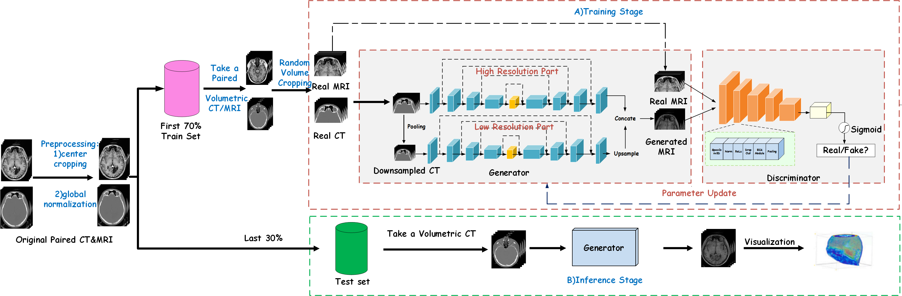
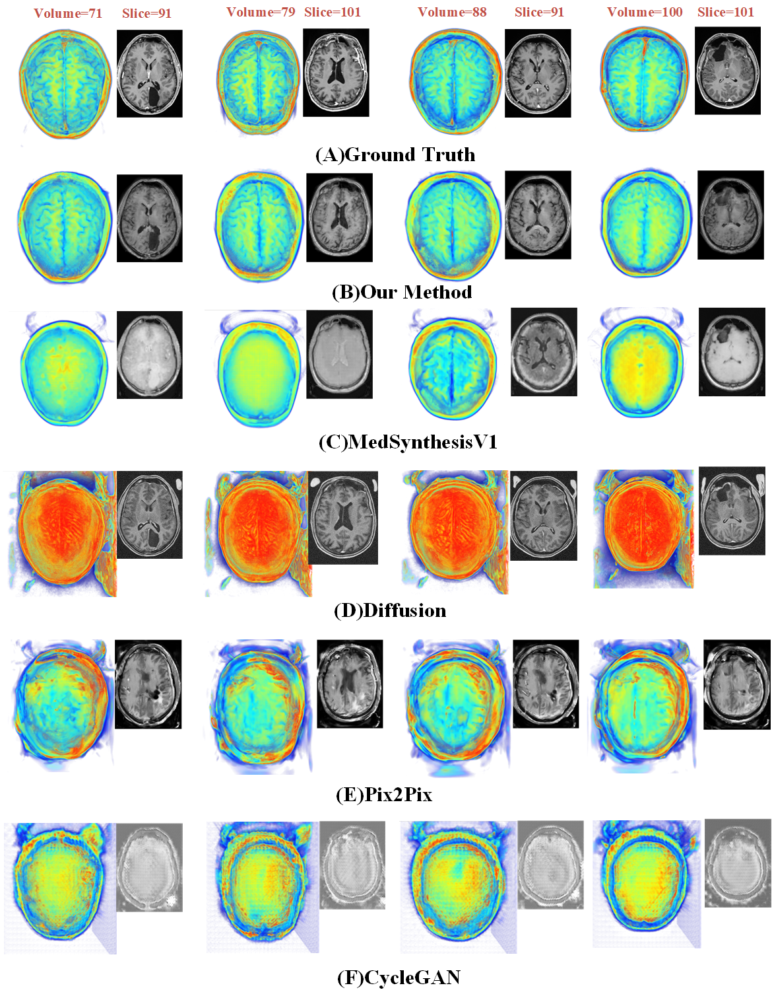

# xxxx: Transformer-based Generative Adversarial network for 3D CT-to-MRI modality translation
This repository is an official implementation of the work named ""
## Introduction
This network adopts a dual-input generative adversarial network(GAN). 
It mainly consists of three parts:
the convolutional branch(High Resolution Part) contained in the Generator is dedicate to extract the local feature information, 
while the transformer branch(Low Resolution Part) contained in the Generator is focus on the extraction of global long-range dependencies. 
The Discriminator is a fully-convolutional network which is used to distinguish the realness of generated MRI volumes.

## Dataset
The dataset employed in this study is the SynthRAD2023 dataset, which was proposed by the International Conference on Medical Image Computing and Computer-Assisted Intervention (MICCAI) in 2023. 
For a comprehensive description of the dataset, please refer to the [Grand Challenge website](https://synthrad2023.grand-challenge.org). In this research, we utilise brain and pelvis dataset. 
Each dataset was selected based on the first 100 paired volumetric CT and MRI scans out of a total of 180 pairs. 

## Train
The training process can start by execute the train.py
During the training process, we randomly cropped original CT/MRI into half of the original size
## Test
The test process can strat by execute the test.py
During the test process, the volume data is the original size
## Visualization Result

